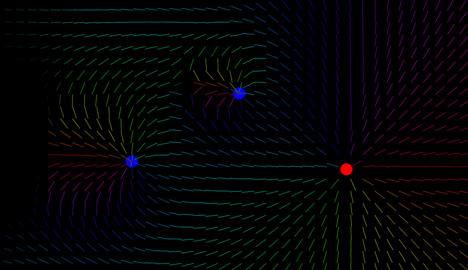
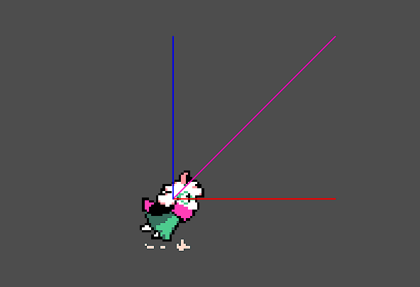

# Vector display 2D
Inspired by [Easy Vector Display](https://github.com/neropatti/easy_vector_display) by neropatti.

Show vectors on your 2D game with ease, customization and good performance. Some examples:

## Usage
- Create a new `VectorDisplay2D` node on your scene
- Choose a target node and a property on it (e.g.: velocity) of type **Vector2**
- Customize and setup colors, scale, and behaviours
- Enjoy! Use `Shift + V` to quickly toggle visibility during runtime
- Change the visibility shortcut on [`display shortcut file`](addons/vector_display_2d/display_shortcut.tres) on **Godot editor**
- Update and customize vectors on runtime with low overhead

## Planned features
- Arrowheads and decorators
- Better customization and performance
- Autoload access (if needed)
- 3D compatibility (version 2)