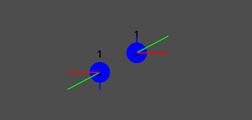

# Vector display 2D
Inspired by [Easy Vector Display](https://github.com/neropatti/easy_vector_display) by neropatti.

Show vectors on your 2D game with ease.

## Usage
- Create a new `VectorDisplay2D` node on your scene
- Choose a node and a property (e.g.: velocity) of type **Vector2**
- Customize and setup colors, scale, etc.
- Enjoy! Use `Shift + V` to quickly toggle visibility during runtime
- Change the visibility shortcut on `display_shortcut.tres` file on Godot editor

## Planned features
- Arrowheads instead of lines
- 3D compatibility
- Better customization and performance